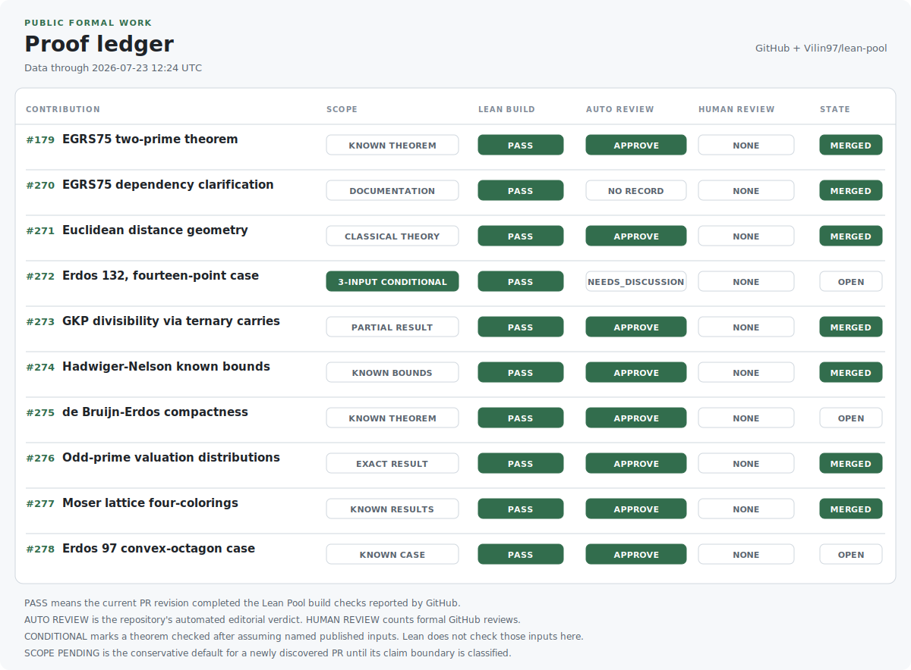

# Egor Lyfar

Independent researcher. My primary target is fundamental mathematics: formal proofs in Lean, and an AI research workflow built to be inspected. The same method drives open-source work in rare-disease biology.

## The mission

Fundamental mathematics is my primary target and my test bench for the AI research workflow. I use Lean to expose assumptions and make generated proofs inspectable. Lean checks a proof term against its stated assumptions, so a claim either type-checks or it does not.

The same method carries into a science mission I run in the open: computational, source-linked work on rare genetic disease, including gene therapy. I publish the methods and results so specialists can inspect them. Gene therapy evidence requires biological experiments, clinical data, and specialist review. None of that happens in this code.

> One rare disease is rare. Rare diseases together are not.

## Public proof ledger

The generator reads current public GitHub data. Each row separates Lean builds, automated Lean Pool editorial review, formal human review, claim scope, and PR state.

<picture>
  <source media="(prefers-color-scheme: dark) and (max-width: 600px)" srcset="assets/proof-ledger-dark-mobile.svg">
  <source media="(prefers-color-scheme: dark)" srcset="assets/proof-ledger-dark.svg">
  <source media="(max-width: 600px)" srcset="assets/proof-ledger-light-mobile.svg">
  
</picture>

[EGRS75 merged PR #179](https://github.com/Vilin97/lean-pool/pull/179) | [Active Lean Pool PRs #271-#276](https://github.com/Vilin97/lean-pool/pulls?q=is%3Apr+is%3Aopen+author%3Alyfar) | [Generator and fixtures](scripts/generate_ledger.py)

## Research in public

| Work | Evidence | Boundary |
| --- | --- | --- |
| [STRC Research](https://github.com/lyfar/strc-research) | Public computational work on STRC-related DFNB16 hearing loss | Preclinical hypotheses with no therapeutic claim |
| [Distance Geometry in Lean](https://github.com/lyfar/distance-geometry-lean) | Source-linked Lean formalization and [draft PR #271](https://github.com/Vilin97/lean-pool/pull/271) | A test of the research workflow in mathematics |
| [EGRS75 in Lean](https://github.com/lyfar/egrs75-lean) | Lean build record, automated review, and maintainer merge | A formalization of a known theorem |
| [Genomic Variant Research](https://github.com/lyfar/genomic-variant-research) | Auditable variant-analysis workflow | Research support; clinicians make diagnoses |

## Work with me

I welcome mathematical review, AI workflow audits, rare-disease expertise, and partners who can support experimental validation.

[MISHA Foundation](https://misha.lyfar.com) | [GitHub](https://github.com/lyfar) | [Email](mailto:egor.lyfar@gmail.com)
